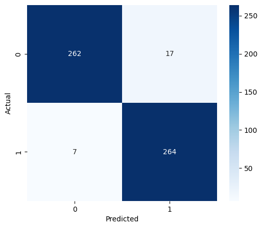
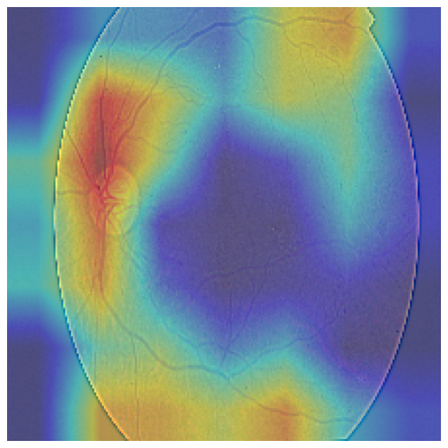

# Attention Based Multi Scale Ensemble Network for Diabetic Retinopathy Detection

## Overview

This project presents an explainable deep learning system for detecting **Diabetic Retinopathy (DR)** from retinal fundus images.

The original 5-class classification problem was reformulated as a binary classification task:

* **NO_DR** (Healthy Retina)
* **DR** (Presence of Diabetic Retinopathy)

The model combines **EfficientNetB0 transfer learning**, an **attention mechanism**, and **Grad-CAM explainability** to achieve high diagnostic performance.

---

## Results

| Metric        | Score      |
| ------------- | ---------- |
| Test Accuracy | **95.64%** |
| ROC-AUC       | **0.9937** |

---

## Model Architecture

```text
Input Image
      ↓
EfficientNetB0
      ↓
Global Average Pooling
      ↓
Attention Block
      ↓
Dense Layers
      ↓
Binary Prediction
```

---

## Features

* EfficientNetB0 Transfer Learning
* Attention-Based Feature Refinement
* Data Augmentation
* Fine-Tuning
* ROC-AUC Evaluation
* Confusion Matrix Analysis
* Grad-CAM Explainability

---

## Visual Results

### Confusion Matrix



### ROC Curve


### Grad-CAM Visualization



---

## Tech Stack

* Python
* TensorFlow / Keras
* OpenCV
* Scikit-Learn
* NumPy
* Pandas
* Matplotlib
* Google Colab

---

## Project Structure

```text
DiabeticRetinopathyProject/
│
├── notebooks/
├── outputs/
├── requirements.txt
└── README.md
```

---

## Future Work

* Streamlit Deployment
* FastAPI Integration
* Docker Containerization
* Multi-Class DR Classification

---

## Author

Sanjara
